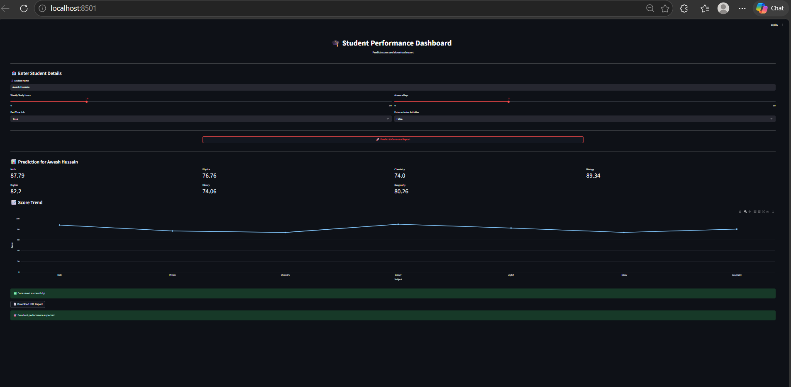

# 🎓 Student Performance Prediction Dashboard

📊 Predict student performance using Machine Learning + Interactive Dashboard  

---

## 📌 Overview
This project is a **Machine Learning-based web application** that predicts student performance across multiple subjects using behavioral data such as study hours, attendance, and extracurricular activities.

The application also provides:
- 📊 Interactive visualizations  
- 📄 Downloadable PDF reports  
- 💾 Data logging for future analysis

  ## 📸 Application Preview

| Dashboard | Predictions |
|----------|------------|
|  |  |

---

## 🚀 Features

- 🔮 Predict scores for 7 subjects:
  - Math, Physics, Chemistry, Biology, English, History, Geography  
- 📈 Interactive line graph (hover to view values)  
- 📄 Download prediction report as PDF  
- 💾 Save user data into CSV file  
- 🎯 Performance insights (Excellent / Average / Needs Improvement)  
- 🖥️ Clean and user-friendly dashboard  

---

## 🛠️ Tech Stack

- Python  
- Pandas  
- Scikit-learn  
- Streamlit  
- Plotly  
- ReportLab  

---

## 📂 Dataset

### Input Features:
- Weekly self-study hours  
- Absence days  
- Part-time job (True/False)  
- Extracurricular activities (True/False)  

### Target Outputs:
- Math score  
- Physics score  
- Chemistry score  
- Biology score  
- English score  
- History score  
- Geography score  

---

## ⚙️ How It Works

1. Load dataset  
2. Remove unnecessary columns (ID, name, email)  
3. Convert categorical data into numeric format  
4. Train model using Random Forest  
5. Take user input via dashboard  
6. Predict subject scores  
7. Display results with interactive graph  
8. Save data and generate PDF report  

---

## 🧠 Machine Learning Model

- **Algorithm:** Random Forest Regressor  
- **Type:** Multi-output Regression  
- **Wrapper:** MultiOutputRegressor  

---

## ▶️ How to Run the Project

### 1. Install dependencies
```bash
pip install pandas scikit-learn streamlit plotly reportlab
